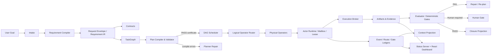

# AI4Research / Solar

> 面向软件工程与科学研究的本地优先（local-first）多智能体执行框架：把自然语言目标编译为受治理的任务图，在可替换的 AI / CLI / tool operators 上执行，并以证据、评审和可回放状态闭环交付。

AI4Research 是 Solar 体系在 `Stellven/AI4Research` 仓库中的产品化分支。项目的当前主线不是一个云端 SaaS，也不只是“在 tmux 中启动多个 Agent”；它是一套运行在开发者工作站上的 **AI-native execution fabric**，重点解决以下问题：

- 将模糊需求转化为可验证的 `Requirement IR`、contracts 与 `TaskGraph`；
- 将 Planner、Builder、Evaluator 等逻辑角色与具体模型、CLI、浏览器或本地算子解耦；
- 通过 DAG、依赖、write scope、lease、policy 与 human gate 控制并发执行；
- 将状态、上下文、路由、评审与交付证据外置为可审计 artifacts；
- 同时支撑代码交付（Product Delivery）和科研工作流（AutoSci / DeepResearch）。

> **当前发布线：** `VERSION` 为 `1.0.0-rc.9`。仓库根目录的 Bun package metadata 仍保留 `3.0.0`，它不应被解释为当前安装器发行版本。  
> **当前主分支：** `openJiuwen-Solar`。  
> **成熟度：** Release Candidate；适合本地试用、架构研究与受控团队内实验，不应直接视为多租户生产控制平面。

---

## 目录

- [核心能力](#核心能力)
- [系统边界与成熟度](#系统边界与成熟度)
- [架构总览](#架构总览)
- [端到端执行链路](#端到端执行链路)
- [安装](#安装)
- [快速开始](#快速开始)
- [常用命令](#常用命令)
- [组件系统](#组件系统)
- [运行时 artifacts](#运行时-artifacts)
- [AutoSci 与 DeepResearch](#autosci-与-deepresearch)
- [Dashboard 与 Desktop](#dashboard-与-desktop)
- [配置与模型路由](#配置与模型路由)
- [开发与测试](#开发与测试)
- [安全边界](#安全边界)
- [已知限制](#已知限制)
- [代码结构](#代码结构)
- [贡献约束](#贡献约束)
- [许可证](#许可证)

---

## 核心能力

### 1. Requirement Compiler

输入不是直接交给 Builder，而是先被编译成一组有版本、可追踪、可校验的 artifacts：

```text
raw request
  └─ request_envelope.json
      └─ requirement_ir.json
          ├─ prd.md
          ├─ Contracts.yaml
          ├─ task_graph.json
          ├─ task_dag.state.json
          └─ closure.json
```

编译层负责请求分类、需求规范化、artifact 引用、摘要哈希、traceability 与交付目标。当前 canonical request types 包括：

- `implementation`
- `full_prd`
- `research`

并兼容历史标签 `short_impl`、`full_spec`。

### 2. Governed TaskGraph

Planner 生成的任务图在调度前进入 compile-check，而不是被盲目执行。主要约束包括：

- DAG 无重复节点、悬空依赖或环；
- task type 必须被 capability capsule 接纳；
- logical operator、physical role 与 node kind 必须一致；
- read/write scope 必须可解析并位于允许的 artifact roots；
- gate type、gate command 和 pytest path 必须满足 allowlist；
- 节点数量、repair budget 与 operator constraints 必须合法；
- 通过校验后生成 plan certificate，防止已认证计划被静默篡改。

### 3. Capability-aware Scheduling

调度器不只看“哪个模型空闲”，而是综合：

- dependency readiness；
- write-scope conflict；
- capability / capsule compatibility；
- operator availability、health、quota 与 policy；
- actor lease；
- concurrency budget；
- evaluator / human gate 状态。

具有重叠 `write_scope` 的节点不会进入同一并发 batch；未声明写域的节点按 exclusive writer 处理。

### 4. Logical / Physical Operator 解耦

TaskGraph 绑定的是逻辑算子，例如：

- `DeepArchitect`
- `ImplementationWorker`
- `PatchWorker`
- `TestDesigner`
- `Verifier`
- `ResearchScout`
- `ResearchSynthesizer`
- `ContextCompressor`
- `SecurityGate`
- `QuotaBroker`
- Scientific / Browser operators

运行时再将逻辑算子解析为具体 physical operator，例如 Codex CLI、Claude Code、Gemini、GLM、DeepSeek、本地模型、命令行程序或浏览器执行器。更换模型或载体不要求重写 DAG。

### 5. Evidence-first Completion

项目将“完成”定义为可验证状态，而不是 Agent 自报成功。运行时记录：

- dispatch 与 route；
- actor / operator 选择理由；
- context packet；
- lease 与 write scope；
- action contract；
- test / verifier evidence；
- human verdict；
- repair attempt；
- artifact lineage；
- closure projection。

只有节点、必要 gates 与验收追踪都满足条件时，父 sprint 才能闭合。

### 6. Context Projection

上下文不是事实源，而是对 session event log 的可追溯投影。系统记录：

- 原样纳入的 event IDs；
- 被摘要的 event ranges；
- 因 token budget 被丢弃的 ranges；
- KB / Mirage / QMD / Obsidian / Solar DB 命中；
- degraded sources；
- secret redaction；
- context-injected 审计事件。

这使 context compression 不再等同于不可逆“遗忘”。

### 7. AutoSci / DeepResearch

科研路径覆盖发现、摄取、分析、实验、评审、论文与知识沉淀。底层还提供：

- deterministic IDs 与 SHA-256 content hash；
- source / evidence / claim / citation 数据模型；
- claim–evidence links；
- UTF-8 character / byte span verification；
- SQLite + JSONL persistence；
- unsupported-claim、citation-span 与一致性检查；
- report AST 与编译输出。

---

## 系统边界与成熟度

| 子系统 | 当前定位 | 说明 |
|---|---|---|
| Bash/Python Harness | **主运行时** | 当前最完整、默认使用的本地控制面与执行面 |
| Requirement Compiler | **已实现** | 生成 request、IR、contracts、graph、state、closure 等 artifacts |
| DAG Scheduler | **已实现** | 支持依赖、写域冲突、并发、gate 与 parent closure |
| Gate / Evidence Ledger | **已实现** | append-only 记录与 fail-closed verdict consumption |
| React Dashboard | **已实现** | session、process stream、deliverables、settings、usage、human gates |
| AutoSci | **已实现，集成依环境而异** | 本地 skill 与 workflow 可用；远端/浏览器能力取决于配置 |
| Bun/TypeScript `core/` | **可选、演进中** | daemon/dashboard 与部分 compatibility implementation，不是主控制面等价替代 |
| Electron Desktop | **可打包、仍需硬化** | macOS / Windows / Linux shell；不等同于已签名生产桌面发行版 |
| 多机分布式调度 | **未完成** | 当前持久化与 lease 以单机文件系统、SQLite、tmux 为核心 |
| 多租户隔离 | **不在当前边界内** | 不应将本地 status server 暴露为公网服务 |

---

## 架构总览



### 分层

| Plane | 主要职责 | 关键代码 |
|---|---|---|
| Intent / Requirement Plane | intake、分类、IR、PRD、contracts、traceability | `harness/lib/requirement_compiler/`, `compiled_sprint_planner.py` |
| Planning Plane | TaskGraph、capsule、logical operator、plan certificate | `plan_validator.py`, `workflow_contract.py`, `apo_plan_compiler.py` |
| Scheduling Plane | readiness、conflict、parallelism、quota、route | `graph_scheduler.py`, `multi_task_runner.py`, `concurrency_policy.py` |
| Execution Plane | actor、lease、mailbox、action contract、tool execution | `actor_runtime.py`, `actor_lease.py`, `actor_mailbox.py`, `execution_broker.py` |
| Evidence / State Plane | event、gate、route、evidence、closure | `event_ledger.py`, `gate_ledger.py`, `evidence_ledger.py` |
| Context Plane | event projection、budget、redaction、knowledge recall | `context_projection.py`, `context_store.py`, `solar-unified-context.py` |
| Presentation Plane | HTTP API、SSE、dashboard、deliverables、desktop shell | `harness/lib/symphony/status-server.py`, `harness/status-server/react-app/`, `desktop/` |
| Research Plane | AutoSci workflows、evidence/claim/citation substrate | `harness/plugins/autosci/`, `harness/lib/research/`, `.agents/skills/` |

---

## 端到端执行链路

### 1. Intake

用户提交目标后，系统创建 sprint/request 身份，并把原始输入、分类、仓库上下文和附件写入 request envelope。

### 2. Requirement Compilation

Requirement Compiler 输出 PRD、contract manifest、TaskGraph、初始 DAG state 和 closure record。每个关键 artifact 都有稳定路径和 schema version。

### 3. Planning 与 Compile-check

Planner 将需求映射为节点、依赖、logical operator、capability capsule、read/write scope、acceptance IDs 与 gates。

随后由 validator 检查：

```text
schema
→ graph validity
→ capsule admission
→ scope containment
→ operator resolvability
→ gate legality
→ repair budget
→ certificate
```

编译失败不会进入 Builder；错误会写入 plan-compile artifact，供 Planner 修复。

### 4. Scheduling

Scheduler 只选择 ready nodes，并在同一 wave 中排除 write conflicts。运行时可依据 quota、auth、health 和 availability 重绑定 physical operator，而不修改已认证的逻辑计划。

### 5. Dispatch 与 Execution

Actor Runtime：

1. 校验 capability token 与 safety boundary；
2. 解析 logical operator；
3. 获取 actor lease；
4. 装载 context packet；
5. 写入 file mailbox inbox；
6. 写入 scheduler/evidence record；
7. 由执行器处理 task envelope；
8. 将机器可读结果写入 outbox。

对受治理 action，Execution Broker 采用以下 FSM：

```text
proposed
  → validated
  → policy_passed
  → leased
  → executing
  → verified
  → committed
```

失败状态包括：

```text
schema_failed
policy_denied
lease_denied
exec_failed
verify_failed
```

### 6. Evaluation、Repair 与 Human Gate

Evaluator verdict 只有在来源、generation、author 和证据满足 gate-consumability 规则时才会被消费。自评、过期 generation、doctor backfill 或未分配 evaluator 的结论默认不能作为最终 gate。

失败可以进入受限 repair；超过 repair budget 后转为失败或人工处理，不允许无限自循环。

### 7. Closure

Closure projection 汇总：

- all nodes passed；
- all required gates passed；
- acceptance traceability coverage；
- tests / evals；
- changed files；
- residual risks；
- open / failed / human-review nodes。

---

## 安装

### 支持平台

- macOS：第一优先级；
- Linux：支持 x86_64 / arm64；
- Windows：通过 WSL2；当前仍属于实验性路径；
- Native Windows shell：不是 Harness 的直接运行环境。

### 基础要求

安装器本身可运行在较旧系统 Bash 上；真正启动 Harness cockpit 时需要：

- Python 3.11+
- Bash 4+
- Git
- tmux
- jq
- Codex CLI 或 Claude Code CLI 中至少一个
- 可选：Bun，用于 `core-runtime`
- 可选：Cargo，用于 browser skills

### 从当前分支安装

```bash
git clone --branch openJiuwen-Solar https://github.com/Stellven/AI4Research.git
cd AI4Research

# 先查看动作，不写入系统
./install.sh --dry-run

# 交互式安装
./install.sh

# 或无人值守安装默认组件
./install.sh --yes
```

安装目标默认位于：

```text
~/.solar/          # runtime、config、db、bin、harness
~/.claude/solar/   # Claude kernel overlay、rules、hooks、agents
```

安装器不需要 root，并尽量将写入限制在用户目录。

### 精确选择组件

```bash
./install.sh --list-components

./install.sh --yes \
  --components kernel,harness,autosci

./install.sh --yes \
  --components kernel,harness,autosci,core-runtime
```

### 验证

```bash
export PATH="$HOME/.solar/bin:$PATH"

solar version
solar status
solar doctor --json
solar harness preflight
```

---

## 快速开始

### 1. 选择运行时

```bash
solar harness runtime show

# 使用 Codex
solar harness runtime use codex

# 或使用 Claude Code
solar harness runtime use claude
```

### 2. 完成所选运行时的认证

Codex：

```bash
codex login --device-auth
```

Claude Code：

```bash
claude
```

只需要认证实际选中的 runtime。`doctor` 和 `preflight` 可以验证依赖与配置，但不能替代一次真实模型启动。

### 3. 启动 Dashboard

```bash
solar harness status-server start
solar harness status-server status
```

默认访问：

```text
http://127.0.0.1:8765/
```

端口占用时会在 `8765–8775` 范围内回退；实际端口写入：

```text
~/.solar/harness/run/status-server.port
```

### 4. 启动 Product Delivery cockpit

```bash
cd /path/to/your/project
solar harness start "$(pwd)"
solar harness status
```

典型角色包括：

```text
PM → Planner → Builder → Evaluator
```

这只是职责视图；真实执行是 capability-routed DAG，不应被理解为固定线性 pipeline。

### 5. 提交需求

```bash
solar harness intake \
  "为当前项目增加可恢复的后台任务执行，并补充测试和迁移说明"
```

### 6. 处理人工 gates

```bash
solar harness plan-verdict <sprint-id> approve "plan reviewed"
solar harness eval-verdict <sprint-id> pass "acceptance evidence verified"
```

拒绝或失败：

```bash
solar harness plan-verdict <sprint-id> reject "scope is too broad"
solar harness eval-verdict <sprint-id> fail "regression test failed"
```

---

## 常用命令

### 生命周期

```bash
solar version
solar status
solar doctor [--json]
solar update
solar repair
solar backup [--out FILE]
solar restore <archive>
solar components list
solar uninstall [--yes] [--keep-data] [--dry-run]
```

### Harness

```bash
solar harness preflight
solar harness start [workdir]
solar harness status
solar harness refresh
solar harness doctor
solar harness intake "request"
```

### Runtime 与模型

```bash
solar harness runtime show
solar harness runtime use codex
solar harness runtime use claude

solar harness models show
solar harness models doctor
solar harness models set-main opus [--apply]
solar harness models set-main anthropic-sonnet [--apply]
solar harness models set-lab-matrix \
  anthropic-sonnet,anthropic-sonnet,anthropic-sonnet,anthropic-sonnet \
  [--apply]
```

### Dashboard

```bash
solar harness status-server start
solar harness status-server stop
solar harness status-server restart
solar harness status-server status
```

### Integrations / Capabilities

```bash
solar harness integrations status
solar harness integrations plugins
solar harness integrations list
solar harness integrations validate
```

### Mermaid 与 Benchmark

```bash
solar harness mermaid
solar harness mermaid --open path/to/graph.mmd
solar harness benchmark --help
```

---

## 组件系统

默认选择为 `kernel + harness + autosci`；如果检测到 Bun，则自动加入 `core-runtime`。

| Component | 默认 | 依赖 | 作用 |
|---|---:|---|---|
| `kernel` | on | Python | Claude Code kernel overlay、rules、hooks、agents |
| `harness` | on | Python、kernel | Python/Bash 主运行时 |
| `autosci` | on | Python、harness | 科研 skills、tools 与 workflow assets |
| `core-runtime` | auto | Bun、kernel | TypeScript daemon / dashboard / compatibility runtime |
| `skills-md` | off | kernel | 通用 Markdown skills |
| `skills-office` | off | kernel | Office productivity skills |
| `skills-obsidian` | off | kernel | Obsidian skills |
| `skills-calendar` | off | macOS、kernel | Calendar skills |
| `skills-browser` | off | Cargo、kernel | Browser automation skills |
| `codex-bridge` | off | Python、kernel | 外部 coding agent 文件桥 |
| `mempalace` | off | Python、kernel | Semantic memory MCP |
| `daemons` | off | platform-dependent | 用户级后台 daemon |
| `status-daemon` | off | harness | status server 后台运行 |

完整参数与组件说明见：

- [`INSTALL.md`](INSTALL.md)
- [`docs/COMPONENTS.md`](docs/COMPONENTS.md)
- [`docs/UNINSTALL.md`](docs/UNINSTALL.md)
- [`docs/WINDOWS.md`](docs/WINDOWS.md)

---

## 运行时 artifacts

默认根目录：

```text
~/.solar/harness/
```

### Sprint artifacts

```text
sprints/
  <sid>.request_envelope.json
  <sid>.requirement_ir.json
  <sid>.prd.md
  <sid>.Contracts.yaml
  <sid>.task_graph.json
  <sid>.task_dag.state.json
  <sid>.closure.json
  <sid>.design.md
  <sid>.plan.md
  <sid>.traceability.json
  <sid>.handoff.md
  <sid>.gate-ledger.jsonl
```

### Actor runtime

```text
actors/
  <actor-id>/
    inbox/
    outbox/
    logs/
    state.json
    heartbeat.json

run/
  actor-leases/
  actor-evidence/
  context-store/
  multi-task/
  events.db
  events.jsonl
```

### 状态分离原则

| Artifact | 角色 |
|---|---|
| `task_graph.json` | 相对稳定的执行规格 |
| `task_dag.state.json` | 运行时 node/gate/lease/dispatch state |
| `closure.json` | 父 sprint 的闭合投影 |
| `events.db` | append-only event source of truth |
| `events.jsonl` | 可读镜像 |
| `gate-ledger.jsonl` | verdict、repair、route、transition 审计 |
| actor evidence | 调度理由、context、capsule、physical plan、verification |
| mailbox | actor task/result transport |

不要把 tmux pane 内容或模型对话历史当作唯一状态源。

---

## AutoSci 与 DeepResearch

### 查看 AutoSci skills

```bash
solar harness autosci skills list
```

### 文本式调用

```bash
solar harness autosci "/discover efficient transformer inference"
solar harness autosci "/research KV cache compression"
solar harness autosci "/exp-design speculative decoding benchmark"
solar harness autosci "/paper-draft"
```

主要能力覆盖：

- discovery / daily arXiv；
- ingest / prefill / survey；
- research / ideation / novelty；
- experiment design / run / status / evaluation；
- review / rebuttal / refine；
- paper plan / draft / compile；
- poster / visualization；
- research wiki / memory / graph update。

部分命令涉及远端执行、知识库变更、reset、compile 或外部 side effect，会进入审批或 policy gate。

### DeepResearch 数据层

底层模块位于：

```text
harness/lib/research/
```

独立说明见：

- [`harness/README.research.md`](harness/README.research.md)

---

## Dashboard 与 Desktop

### Status Server

主后端：

```text
harness/lib/symphony/status-server.py
```

核心能力包括：

- status / sprint / events；
- Server-Sent Events；
- DAG / projection；
- intake 与 human verdict；
- deliverables 浏览与预览；
- usage 与 runtime settings；
- integration health；
- Mermaid viewer；
- auth/runtime diagnostics。

默认仅绑定 loopback。WSL NAT 场景可能绑定 `0.0.0.0`，此时 API token 默认强制启用。不要把该服务直接暴露到公网。

### React App

```text
harness/status-server/react-app/
```

技术栈：

- React
- TypeScript
- Vite
- React Router
- Radix UI
- React Markdown
- Motion

设计契约见 [`DESIGN.md`](DESIGN.md)。

### Electron Desktop

```text
desktop/
```

提供 macOS DMG、Windows portable 和 Linux AppImage 的构建配置。当前桌面壳适合开发验证；正式分发前仍需要完成签名、公证、hardened runtime、自动更新与供应链验证。

---

## 配置与模型路由

### 用户配置

典型配置文件：

```text
~/.solar/harness/config/solar-user-config.json
```

常见字段：

```json
{
  "runtime": "codex",
  "models": {
    "pm": "opus",
    "planner": "opus",
    "builder": "opus",
    "evaluator": "opus"
  },
  "codex": {
    "search": true,
    "effort": "medium"
  }
}
```

仓库内配置应视为默认模板或示例，不应提交个人凭据、真实主机名或私有路径。

### API-backed integrations

安装本身不要求 API key。需要 API 路径时：

```bash
cp .env.template .env
```

可选 provider 包括：

- Anthropic / Claude
- OpenAI / Codex
- Zhipu GLM
- DeepSeek
- Gemini
- local OpenAI-compatible runtime

不要提交 `.env`。

### Logical Operator Catalog

```text
harness/config/logical-operators.json
```

### Physical Operator Catalog

```text
harness/config/physical-operators.json
```

physical operator 配置可能包含高权限启动参数、订阅认证、base URL、quota 与本地命令。启用前必须审查其：

- `enabled`
- `available`
- `deprecated`
- `health_status`
- `auth_mode`
- `launch_cmd`
- `risk_constraints`
- `max_concurrency`

---

## 开发与测试

### Bun / TypeScript core

```bash
bun install --frozen-lockfile
bun test
bun run dev
```

其他脚本：

```bash
bun run dashboard
bun run test:ui
bun run test:llm
bun run smoke:skills
bun run smoke:health-monitor
```

`test:llm` 可能产生真实 provider 调用；运行前检查凭据与费用边界。

### React Dashboard

```bash
cd harness/status-server/react-app
npm ci
npm run typecheck
npm run build
```

构建前会运行 node-actor 与 run-pipeline 检查。

### Python

从仓库根目录按子模块运行：

```bash
python3 -m pytest harness/tests -q
python3 -m pytest harness/tests/research/unit -q
python3 -m pytest harness/tests/research/integration -q
python3 -m pytest harness/tests/research/negative -q
```

### Installer / Runtime Smoke

安装相关变更至少应覆盖：

```text
dry-run
fresh install
doctor
status server health
harness preflight
update / repair
clean uninstall
```

涉及 tmux、Codex、Claude 或浏览器的路径需要真实 runtime/auth 环境；纯静态测试不能证明 live delegation 成功。

---

## 安全边界

当前代码包含以下防护：

- 用户级安装，默认不要求 root；
- secrets、env、DB 与运行 artifacts 默认被 Git 忽略；
- status server 默认 loopback；
- 非 loopback 场景 token enforcement；
- sprint/path slug 校验；
- secret redaction；
- write-scope containment；
- gate command allowlist / option denylist；
- capability token、lease 与 policy checks；
- 高风险 action 的 human approval；
- evaluator verdict 的 fail-closed consumption；
- append-only event/gate/evidence records。

这些机制不是完整的 OS sandbox 或多租户安全边界。尤其应注意：

1. shell、CLI、browser 和 command operators 仍继承本机用户权限；
2. keyword-based safety classification 只能作为 guardrail，不能替代结构化 policy；
3. 高权限 CLI 参数只能在可信工作目录和受控账号中使用；
4. WSL NAT 的 `0.0.0.0` 绑定必须配合 token 与防火墙；
5. 不要在不可信网络上暴露 dashboard；
6. 不要对未知仓库启用无人值守、高权限执行；
7. 生产化前应补充正式 threat model、security policy 与漏洞报告流程。

---

## 已知限制

### 1. 单机优先

当前 lease、mailbox、event mirror、tmux 与 SQLite 假设共享本地文件系统。它们适合工作站级 orchestration，不等同于容错分布式 scheduler。

### 2. 两条运行时演进线

`harness/` 是当前产品主线；`core/` 中部分 TypeScript 模块仍是 compatibility / scaffold implementation。两者尚未收敛为单一 canonical runtime。

### 3. 状态面较多

spec、runtime state、closure、event ledger、gate ledger、evidence ledger、mailbox、tmux/process state 同时存在。虽然可审计，但也增加 reconciliation 与 schema migration 成本。

### 4. Live Provider 不可由 Doctor 完全证明

安装、依赖与文件系统检查通过，不意味着模型认证、quota、网络、工具权限与真实 delegation 一定成功。

### 5. 版本 metadata 尚需统一

当前至少存在：

- `VERSION`: `1.0.0-rc.9`
- pipx package: `1.0.0rc9`
- root Bun package: `3.0.0`

发行流程应定义单一 version source of truth。

### 6. Fork 与 upstream 链接仍需清理

部分历史安装、pipx 与文档 metadata 仍引用 OpenSolar upstream。维护此 fork 时应统一到 `Stellven/AI4Research`，或明确声明哪些组件继续跟踪 upstream。

### 7. Desktop 仍非正式生产发行

当前构建配置尚不能替代 code signing、notarization、hardened runtime、auto-update 与 release provenance。

---

## 代码结构

```text
AI4Research/
├── bin/                         # solar / solar-daemon lifecycle entrypoints
├── components.d/                # declarative installer components
├── core/                        # optional Bun/TypeScript runtime
│   ├── daemon/
│   ├── dashboard/
│   ├── orchestrator/
│   └── ...
├── harness/                     # primary Bash/Python execution fabric
│   ├── solar-harness.sh
│   ├── coordinator.sh
│   ├── config/
│   ├── lib/
│   │   ├── requirement_compiler/
│   │   ├── research/
│   │   ├── symphony/
│   │   └── ...
│   ├── plugins/autosci/
│   ├── status-server/react-app/
│   ├── tests/
│   └── workflows/
├── desktop/                     # Electron shell and packaging
├── distribution/pipx/          # thin pipx installer/lifecycle wrapper
├── lib/installer/               # installer implementation
├── kernel/                      # Claude kernel assets
├── skills/                      # skills and capability assets
├── .agents/skills/              # AutoSci / agent skills
├── integrations/                # external provider integrations
├── tests/                       # repository-level tests
├── tools/                       # research and maintenance tools
├── INSTALL.md
├── USER-GUIDE.md
├── DESIGN.md
├── VERSION
└── install.sh
```

---

## 贡献约束

提交运行时变更时，请遵守以下原则：

1. **Requirement/graph/state 分离。** 不要把易变 runtime 字段重新写回稳定 graph spec。
2. **状态变更可审计。** 新状态 writer 必须记录 transition 或 event。
3. **没有 contract，不执行。** 不要为便利而绕过 scope、lease、policy 或 verifier。
4. **Planner 不固定 physical operator。** Planner 声明 capabilities / constraints；runtime 负责最终 binding。
5. **完成必须有 evidence。** 不接受仅凭自然语言“已完成”的路径。
6. **Context 是 projection。** 不要用摘要覆盖或删除原始 session events。
7. **兼容性显式化。** 新旧 schema、alias 与 migration 必须有版本或转换层。
8. **默认安全。** 新 provider、command、browser 或 external-write 能力默认关闭。
9. **不要提交运行 artifacts。** sprint、DB、logs、secrets、reports、cache 与个人配置保持在 Git 之外。
10. **同步文档和版本。** 修改安装入口、命令、组件或发行版本时同步 README、INSTALL、pipx metadata 与 `VERSION`。

---

## 文档

- [安装指南](INSTALL.md)
- [中文用户指南](USER-GUIDE.md)
- [组件参考](docs/COMPONENTS.md)
- [Windows / WSL2](docs/WINDOWS.md)
- [卸载](docs/UNINSTALL.md)
- [GUI 设计系统](DESIGN.md)
- [DeepResearch 模块](harness/README.research.md)

---

## 许可证

本项目使用 [MIT License](LICENSE)。

Copyright © 2026 Sihao Li.
